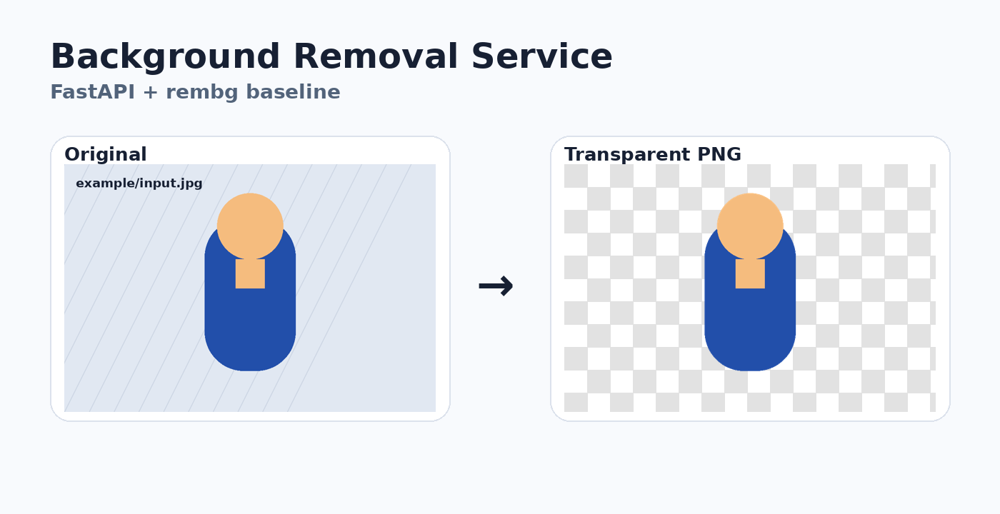

# Background Removal Service

FastAPI web service for removing backgrounds from photos and returning a transparent PNG.



## What is inside

- REST API: `POST /remove-background`
- Browser demo page: `/`
- Swagger/OpenAPI docs: `/docs`
- PNG output with alpha channel
- Input validation by file type, size and image dimensions
- Docker and docker-compose
- Pytest smoke tests
- GitHub Actions CI
- Example input/output images for README and manual checks

The service uses [`rembg`](https://github.com/danielgatis/rembg) with the U²-Net family as a reproducible baseline. The inference layer is isolated, so it can be replaced later with BiRefNet, BRIA RMBG or another matting/segmentation backend.

## Repository structure

```text
background-removal-service/
├── app/
│   ├── main.py          # FastAPI app and routes
│   ├── inference.py     # background-removal pipeline
│   ├── schemas.py       # config and limits
│   └── utils.py         # image validation helpers
├── templates/
│   └── index.html       # simple upload UI
├── static/
│   └── style.css
├── examples/
│   ├── input.jpg        # sample image used in README/curl examples
│   └── output.png       # example transparent PNG result
├── docs/
│   ├── architecture.png
│   └── demo.png
├── tests/
│   └── test_api.py
├── Dockerfile
├── docker-compose.yml
├── requirements.txt
└── README.md
```

## Quick start

```bash
python -m venv .venv
source .venv/bin/activate      # Windows: .venv\Scripts\activate
pip install -r requirements.txt
uvicorn app.main:app --reload
```

Open:

```text
http://127.0.0.1:8000
```

The first inference can take longer because `rembg` may download model weights into the local user cache.

## Docker

```bash
docker compose up --build
```

Then open:

```text
http://127.0.0.1:8000
```

## API usage

```bash
curl -X POST "http://127.0.0.1:8000/remove-background" \
  -F "file=@examples/input.jpg" \
  --output result.png
```

Response:

```text
Content-Type: image/png
```

## Endpoints

| Method | Path | Description |
|---|---|---|
| `GET` | `/` | Upload page |
| `GET` | `/health` | Health check |
| `POST` | `/remove-background` | Remove background from uploaded image |
| `GET` | `/docs` | Swagger UI |

## Configuration

Environment variables:

| Variable | Default | Description |
|---|---:|---|
| `MAX_IMAGE_MB` | `10` | Maximum uploaded image size in megabytes |
| `MAX_IMAGE_SIDE` | `4096` | Maximum width or height before rejection |
| `REMBG_MODEL` | `u2net` | Model name passed to `rembg.new_session()` |

Common model choices: `u2net`, `u2netp`, `isnet-general-use`.

## Run tests

```bash
pytest -q
```

The tests avoid downloading heavy model weights by mocking the inference function where needed.

## Notes for production

This repository is intentionally simple and suitable for a test assignment. For production deployment, consider:

- running inference workers separately from the API server;
- adding GPU acceleration where supported;
- using object storage for large files;
- adding request tracing and metrics;
- rate limiting and authentication;
- evaluating BiRefNet or RMBG 2.0 for higher-quality boundaries.

## Example image location

The README demo image is stored at:

```text
docs/demo.png
```

The curl example image is stored at:

```text
examples/input.jpg
```

The example output is stored at:

```text
examples/output.png
```

